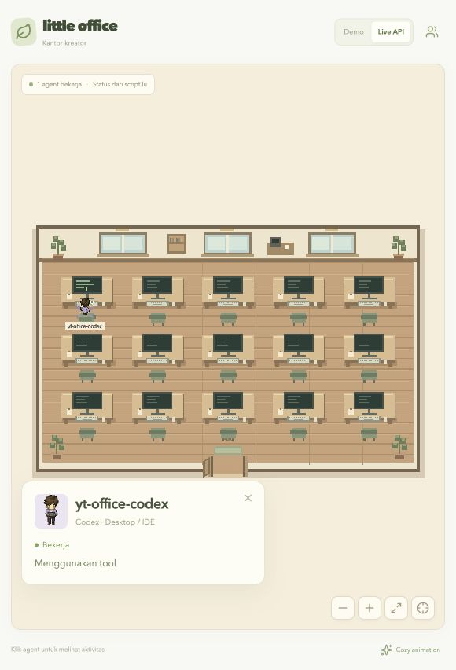

# Client Codex → Nekoffice

Client ini menampilkan aktivitas **Codex Desktop / IDE dan terminal lokal** tanpa mengubah cara lu menjalankan Codex. Satu thread induk = satu orang. Nama orang diambil dari folder kerja terakhir (`cwd`), subagent digabung ke induknya, dan guardian approval internal tidak menjadi orang terpisah.

```text
Codex Desktop / CLI
      │ event lifecycle pada rollout lokal
      ▼
client pengamat Python ── HTTPS + Bearer token ── API Nekoffice
                                                   │ SSE
                                                   ▼
                                              kantor browser
```

Implementasi ini dibuat sendiri. [codex-acp](https://github.com/agentclientprotocol/codex-acp) menjadi referensi arsitektur: adapter tersebut menjalankan Codex App Server dan menerjemahkan event ke ACP melalui stdio. ACP cocok untuk session yang dijalankan melalui client ACP; memasang adapter saja tidak menangkap session desktop yang sudah berjalan. [Dokumentasi App Server resmi](https://learn.chatgpt.com/docs/app-server) menjelaskan lifecycle thread/turn/item. Untuk langsung memantau session lokal yang sudah dipakai, client Nekoffice membaca event lifecycle JSONL yang ditulis Codex.

## Pasang di setiap mesin Codex

Python 3.9+ diperlukan. Tidak perlu OpenAI API key tambahan atau package Python eksternal. Gunakan **token API Nekoffice**, bukan kredensial OpenAI. Token server sama dengan `OFFICE_API_TOKEN` pada deployment.

URL dan token dapat diletakkan di file `.env` lokal. Salin [contoh env client](../integrations/client.env.example) ke `.env`, jangan commit file itu, lalu berikan path-nya ke installer:

```dotenv
LITTLE_OFFICE_URL=https://office.nekoding.xyz
LITTLE_OFFICE_API_TOKEN=token-server-lu
LITTLE_OFFICE_NAME_MODE=alias
LITTLE_OFFICE_MACHINE_LABEL_MODE=hidden
```

```sh
git clone git@github.com:yughoz/nekoffice.git
cd nekoffice
python3 integrations/codex/install.py --server https://office.nekoding.xyz --autostart
```

Atau gunakan `.env`:

```sh
python3 integrations/codex/install.py --env-file .env --autostart
```

Installer meminta token tanpa menampilkannya. Pada macOS, `--autostart` memasang LaunchAgent, mulai berjalan sekarang, dan aktif lagi saat login. Jika client Hermes Nekoffice sudah dikonfigurasi di mesin yang sama:

```sh
python3 integrations/codex/install.py --from-hermes-config --autostart
```

URL dan token dipakai ulang; ID client Codex dibuat sendiri dan tetap stabil. Jangan menyalin `client.json` antar mesin; gunakan installer agar setiap mesin mempunyai ID sendiri. Desktop dan terminal dengan `CODEX_HOME` yang sama cukup memakai satu client pengamat.

Linux: hilangkan `--autostart`, lalu jalankan client dengan supervisor lu sendiri:

```sh
python3 integrations/codex/install.py --server https://office.nekoding.xyz
python3 ~/.codex/nekoffice/client.py run
```

Untuk menjalankan manual dengan file env yang berbeda, tambahkan `--env-file /path/ke/.env` atau set `LITTLE_OFFICE_ENV_FILE`. Pada macOS, installer menyimpan path env ke LaunchAgent sehingga service memakai URL/token yang sama setelah login. Environment process `LITTLE_OFFICE_URL`, `LITTLE_OFFICE_API_TOKEN`, `LITTLE_OFFICE_CLIENT_ID`, `LITTLE_OFFICE_MACHINE_LABEL`, `LITTLE_OFFICE_MACHINE_LABEL_MODE`, `LITTLE_OFFICE_NAME_MODE`, dan opsional `LITTLE_OFFICE_NAME_SALT` mengoverride nilai file.

`LITTLE_OFFICE_NAME_MODE` menerima `alias` (default dan rekomendasi untuk public), `project` (basename folder, hanya jaringan private), `random` (alias baru setiap session), atau `hidden` (nama generik tanpa field project). Alias dibuat lokal dengan salt permission `0600`; nama folder asli tidak pernah masuk payload. `LITTLE_OFFICE_MACHINE_LABEL_MODE=hidden` mencegah label mesin tampil di panel koneksi.

Untuk home lain: tambahkan `--home /path/to/codex-home`. Default membaca `CODEX_HOME`, atau `~/.codex`. Autostart macOS saat ini memakai satu service per user; gunakan satu Codex home pada service tersebut. Instal ulang setelah memperbarui source client.

## Aktivitas yang terlihat

| Event lokal | Tampilan |
| --- | --- |
| `task_started` | Masuk, mulai berpikir |
| Item reasoning / command / file / tool | Berpikir atau mengetik; label aktivitas umum |
| Approval / input request jika dicatat rollout | Menunggu |
| `task_complete` / `turn_aborted` | Pulang |
| Giliran baru pada thread sama | Orang yang sama masuk kembali |
| Client kehilangan jaringan / berhenti | Server menyuruh pulang setelah lease 35 detik |

Polling lokal setiap satu detik. Snapshot dikirim segera saat berubah dan heartbeat setiap 10 detik; kegagalan memakai retry 1–30 detik. Server menahan metadata orang selesai selama 90 detik untuk animasi keluar, lalu menghapusnya. Completion lama tidak menutup turn baru. Thread selesai saat client mulai tidak menjalankan ulang pekerjaan lama.

Client tidak mengirim isi chat, reasoning, command, argument tool, output, instruksi, full path, nama folder asli saat mode aman, atau kredensial OpenAI. Payload hanya berisi ID hash session, nama publik sesuai kebijakan, peran, status, label aktivitas umum, waktu aktivitas, dan penanda aktif. Token hanya berada dalam header autentikasi. Config, salt, dan status lokal permission 0600; tidak disimpan di Git.

## Batas pengamat lokal

Format rollout merupakan format internal Codex, bukan API ACP yang stabil. Parser diuji pada **Codex 0.160.1** dan source event yang tersedia di mesin ini. Pembaruan Codex dapat memerlukan pembaruan parser. Client membaca metadata awal dan maksimal 4 MiB bagian akhir saat bootstrap, lalu hanya tambahan baris baru dengan batas ukuran dan waktu baca. Thread yang baru aktif dalam 120 detik dapat muncul saat client pertama dijalankan; sisanya menunggu aktivitas berikutnya.

Session tanpa event selama **10 menit** dianggap tidak aktif agar session yang crash tidak tinggal selamanya. Tool yang sangat lama tanpa event juga dapat mencapai batas ini; sesuaikan lewat `--stale-seconds 1800` pada installer/client. Event berikutnya mengaktifkan orang lagi. Status approval hanya tersedia jika runtime mencatat event tersebut. Session cloud, ephemeral tanpa rollout, dan mesin lain tidak terbaca oleh observer ini; pasang client pada mesin yang menyimpan rollout. Client ini tidak memulai atau mengambil alih pekerjaan Codex.

## Status dan operasi macOS

```sh
python3 ~/.codex/nekoffice/client.py status
curl https://office.nekoding.xyz/api/integrations/codex
```

Status lokal menunjukkan `running`, `connected`, `activeSessions` dan waktu heartbeat berhasil, tanpa token. Status server menghitung client/produser HTTP yang masih hidup dan session aktif. `activeSessions: 0` normal ketika Codex selesai atau menunggu pesan baru.

```sh
# Restart client pengamat
launchctl kickstart -k gui/$(id -u)/xyz.nekoding.office.codex

# Hentikan dan nonaktifkan autostart
launchctl bootout gui/$(id -u)/xyz.nekoding.office.codex
rm ~/Library/LaunchAgents/xyz.nekoding.office.codex.plist
```

File instalasi: `~/.codex/nekoffice/{client.py,observer.py,client.json,status.json}`. Log service tidak berisi transcript. Menghentikan client tidak membatalkan session Codex.

## Kontrak API

`POST /api/codex/heartbeat` memakai JSON dan `Authorization: Bearer TOKEN_SERVER`. Versi v0.2 menambahkan `machineLabel`, `machineLabelMode`, `bridgeVersion`, `projectName`, `projectKey`, dan `activityCode`; server tetap menerima payload client lama.

```json
{
  "version": 1,
  "clientId": "persistent-machine-id",
  "producerId": "unique-observer-process-id",
  "sequence": 1,
  "sessions": [{
    "agent": {
      "id": "codex-0123456789abcdef01234567",
      "name": "nekoffice",
      "role": "Codex · Desktop / IDE",
      "team": "production",
      "status": "working",
      "task": "Mengubah file project",
      "parentId": null,
      "progress": null
    },
    "active": true,
    "updatedAt": 1791540000000
  }]
}
```

Server memberi namespace ID per client sehingga session dari mesin berbeda tidak bertabrakan. Sequence lama tidak memperbarui lease. Paket divalidasi seluruhnya sebelum diubah. Endpoint Hermes tetap `/api/hermes/heartbeat`; masing-masing endpoint menolak ID provider lain. API manual tetap tersedia.

## Tes

```sh
npm test
npm run build
python3 -m unittest discover -s integrations/codex -v
python3 -m unittest discover -s integrations/hermes -v
```

Tes memeriksa lifecycle/resume, selesai sebelum startup, stale/crash, subagent/guardian, record parsial UTF-8, truncation, bounded tail, penyaringan konten sensitif, autentikasi HTTP, redirect, serta kompatibilitas Hermes.

Pada 9 Oktober 2026, client dipasang dan dijalankan di Mac lokal. API publik menerima 1 client / 1 session aktif dari chat Codex yang sedang membangun bridge ini; nama `yt-office-codex` berasal dari cwd project. Browser mode Live API memperlihatkan avatar di komputer dengan label aktivitas. Ini verifikasi aktivitas asli, tanpa memasukkan agent demo ke API publik.


