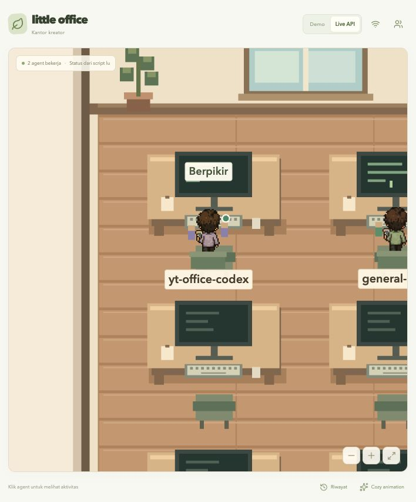
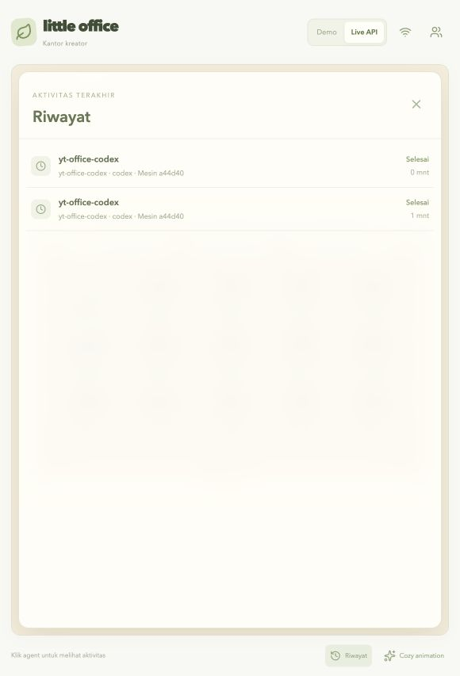
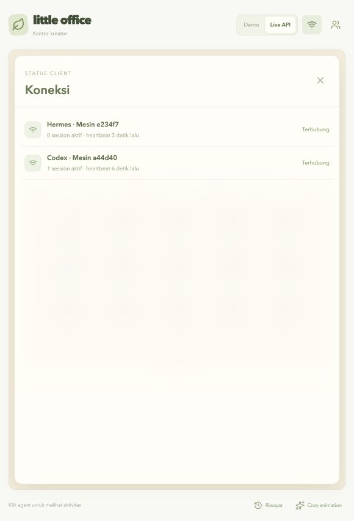

# Deployment office.nekoding.xyz

Live: **https://office.nekoding.xyz/**. Dideploy pada 9 Oktober 2026.

Server: `ubuntu@43.157.243.100`. DNS A domain sudah mengarah ke server. Aplikasi berjalan dalam container `nekoffice-office-1`, dengan restart policy `unless-stopped` dan health check. Caddy host menangani HTTPS Let's Encrypt, redirect HTTP ke HTTPS, dan reverse proxy ke `127.0.0.1:3018`. Port aplikasi hanya terbuka di localhost host.

Source aplikasi yang dideploy berasal dari commit `4a62c87` repo `yughoz/nekoffice`, termasuk panel v0.4, receiver Codex dan Hermes, badge kelompok parent–subagent, pairing device, optimasi render, serta registrasi/login owner lokal. Karena repo privat dan VPS belum punya akses GitHub, release dikirim lewat SSH dari archive commit lokal. Paket hanya menyertakan source build dan aset karakter yang digunakan; aset demo workflow lama tidak diperlukan oleh kantor saat ini.

## Lokasi di VPS

| Lokasi | Isi |
| --- | --- |
| `/opt/nekoffice/releases/<commit>/` | Source build per release |
| `/opt/nekoffice/current` | Symlink release aktif |
| `/opt/nekoffice/.env` | Token API, port bind, dan tag release; permission 0600 |
| `/opt/nekoffice/data/` | Riwayat v0.2; volume host persisten, tidak masuk image |
| `/etc/caddy/conf.d/office.nekoding.xyz.caddy` | Proxy khusus domain kantor |

Password SSH dan token API tidak disimpan di repo. Token API dibuat acak di VPS. Config client lokal disimpan pada `~/.hermes/plugins/little-office-bridge/client.json` dengan permission 0600; URL-nya sudah diset ke domain publik. Gateway lokal berhasil memuat ulang hook. Terminal yang dibuka sebelum perubahan harus dibuka ulang; instal plugin pada tiap profile/mesin tambahan mengikuti [panduan client](SERVER-CLIENT.md).

Client Codex juga sudah terpasang pada Mac lokal, di `~/.codex/nekoffice/`, dengan config permission 0600 dan LaunchAgent `xyz.nekoding.office.codex`. Client ini membaca lifecycle session Desktop/CLI lokal yang sudah berjalan dan memakai token server yang sama. [Panduan Codex](CODEX-BRIDGE.md) menjelaskan cara memasang di mesin lain dan batas parser.

Riwayat v0.2 disimpan di `/opt/nekoffice/data/history.json` melalui bind mount ke container. History yang sedang terbuka tidak dipulihkan sebagai pekerjaan aktif setelah restart; heartbeat baru membuka interval pengamatan baru. Rekaman yang sudah selesai tetap tersedia.

## Operasi server

Setelah login SSH:

```sh
cd /opt/nekoffice/current
docker compose -p nekoffice --env-file /opt/nekoffice/.env -f deploy/compose.production.yaml ps
docker compose -p nekoffice --env-file /opt/nekoffice/.env -f deploy/compose.production.yaml logs --tail 100 office
curl -fsS http://127.0.0.1:3018/api/health
```

Restart aplikasi saja:

```sh
docker compose -p nekoffice --env-file /opt/nekoffice/.env -f deploy/compose.production.yaml restart office
```

Client yang sedang berjalan akan mengirim ulang snapshot pada heartbeat berikutnya. Restart tidak membatalkan pekerjaan Hermes.

Jika mengubah konfigurasi proxy:

```sh
sudo caddy validate --config /etc/caddy/Caddyfile --adapter caddyfile
sudo systemctl reload caddy
```

Caddy menangani pembaruan sertifikat otomatis. Konfigurasi domain kantor diimpor lewat `conf.d/*.caddy` milik konfigurasi host yang sudah ada. Domain dan container situs lain tetap terpisah.

Untuk release baru, kirim source ke direktori release baru, build tag commit baru, jalankan Compose dengan `OFFICE_RELEASE=<commit-baru>`, cek health, kemudian perbarui symlink `current` dan nilai `OFFICE_RELEASE` pada `.env`. Pertahankan token API agar client yang sudah terpasang tetap terhubung. Jangan menyalin `.env` ke dalam build context.

### Login owner lokal dan Public Lobby v0.6

Release v0.6 menyimpan akun lokal dan session di `auth.json`, serta directory office di `offices.json` pada volume `/opt/nekoffice/data`. Owner membuat akun lewat tombol **Registrasi**, lalu login dengan username dan password. Password tidak disimpan mentah; server menyimpan salt dan hash scrypt. Tidak ada konfigurasi OAuth atau provider eksternal.

Public Lobby tersedia di `/lobby`, sedangkan office publik memakai `/office/<slug>`. Backup `/opt/nekoffice/data` sebelum release yang menyimpan akun owner dan directory office.

## Verifikasi deployment

- Docker image berhasil dibuild di VPS dan container sehat.
- `https://office.nekoding.xyz/` dan `/api/health` memberikan HTTP 200 dengan validasi sertifikat normal.
- HTTP diarahkan ke HTTPS dengan status 308.
- Client Python lokal berhasil mengirim heartbeat autentikasi ke API publik.
- SSE dapat dibaca melalui Caddy; POST tanpa token menghasilkan 401.
- Browser memuat kantor dan seluruh aset karakter tanpa error pemuatan.
- Pengamat Codex lokal terhubung melalui HTTPS: server menerima 1 client dan 1 session asli `yt-office-codex` dari chat pengembangan ini; browser memperlihatkan avatar bekerja beserta peran Codex Desktop / IDE.
- 23 tes TypeScript, 10 tes client Codex Python dan 11 tes Hermes Python lolos; build lokal serta image produksi berhasil.
- v0.4 terverifikasi pada browser publik: asset release `index-Cgf_jrDk.js`/`index-6TzjV9uP.css` tersaji melalui HTTPS, panel Koneksi dan filter tetap tersedia, dan UI parent–subagent menampilkan badge jumlah child serta detail lima child saat event heartbeat masuk.
- Perbaikan zoom tersaji lewat `index-B7bgrNzn.js`/`index-CqxTFyGf.css`: nama, aktivitas, badge kelompok, dan label pintu dirender sebagai DOM. Font dibatasi 1–1,65 kali ukuran dasarnya dan kamera tidak membesarkan bitmap teks. Tepian sprite memakai smooth pixel art.
- Build dan 22 tes TypeScript lolos. Uji browser lokal memeriksa zoom maksimal, pembaruan nama/aktivitas, klik avatar, dan penghapusan label bersama session; seluruh fixture dibersihkan. Browser publik memverifikasi label tajam pada session Codex dan Hermes asli tanpa error console.
- Release pairing device berhasil dibuild di VPS dan container sehat. Endpoint token device menuntut token admin utama, menyimpan hash token di volume data, menerima token device pada heartbeat Hermes/Codex, dan mendukung revoke. Browser publik memverifikasi tombol Tambah agent, pilihan Hermes + Codex, dan modal Markdown tanpa memasukkan token server ke halaman.






