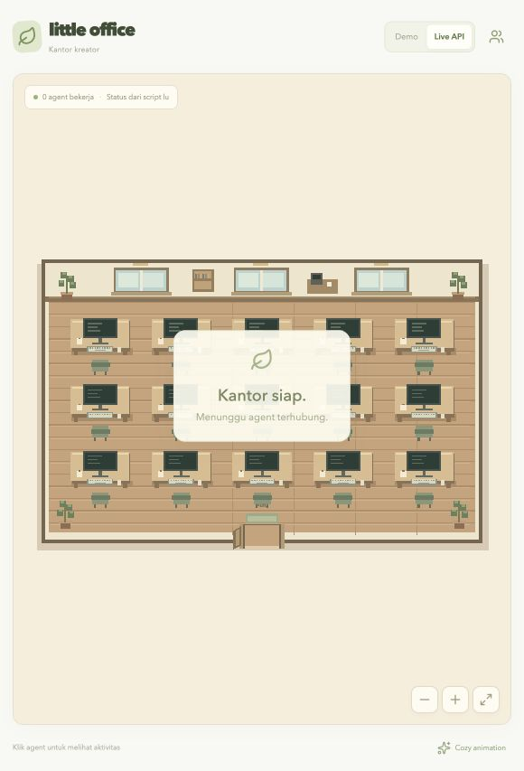

# Deployment office.nekoding.xyz

Live: **https://office.nekoding.xyz/**. Dideploy pada 9 Oktober 2026.

Server: `ubuntu@43.157.243.100`. DNS A domain sudah mengarah ke server. Aplikasi berjalan dalam container `nekoffice-office-1`, dengan restart policy `unless-stopped` dan health check. Caddy host menangani HTTPS Let's Encrypt, redirect HTTP ke HTTPS, dan reverse proxy ke `127.0.0.1:3018`. Port aplikasi hanya terbuka di localhost host.

Source aplikasi yang dideploy berasal dari commit `53883ced3246f5702efd920cf8aa58da960e68cd` repo `yughoz/nekoffice`. Karena repo privat dan VPS belum punya akses GitHub, release dikirim lewat SSH dari archive commit lokal. Paket hanya menyertakan source build dan aset karakter yang digunakan; aset demo workflow lama tidak diperlukan oleh kantor saat ini.

## Lokasi di VPS

| Lokasi | Isi |
| --- | --- |
| `/opt/nekoffice/releases/<commit>/` | Source build per release |
| `/opt/nekoffice/current` | Symlink release aktif |
| `/opt/nekoffice/.env` | Token API, port bind, dan tag release; permission 0600 |
| `/etc/caddy/conf.d/office.nekoding.xyz.caddy` | Proxy khusus domain kantor |

Password SSH dan token API tidak disimpan di repo. Token API dibuat acak di VPS. Config client lokal disimpan pada `~/.hermes/plugins/little-office-bridge/client.json` dengan permission 0600; URL-nya sudah diset ke domain publik. Gateway lokal berhasil memuat ulang hook. Terminal yang dibuka sebelum perubahan harus dibuka ulang; instal plugin pada tiap profile/mesin tambahan mengikuti [panduan client](SERVER-CLIENT.md).

## Operasi server

Setelah login SSH:

```sh
cd /opt/nekoffice/current
docker compose -p nekoffice --env-file /opt/nekoffice/.env -f deploy/compose.production.yaml ps
docker compose -p nekoffice --env-file /opt/nekoffice/.env -f deploy/compose.production.yaml logs --tail 100 office
curl -fsS http://127.0.0.1:3018/api/health
```

Restart aplikasi saja:

```sh
docker compose -p nekoffice --env-file /opt/nekoffice/.env -f deploy/compose.production.yaml restart office
```

Client yang sedang berjalan akan mengirim ulang snapshot pada heartbeat berikutnya. Restart tidak membatalkan pekerjaan Hermes.

Jika mengubah konfigurasi proxy:

```sh
sudo caddy validate --config /etc/caddy/Caddyfile --adapter caddyfile
sudo systemctl reload caddy
```

Caddy menangani pembaruan sertifikat otomatis. Konfigurasi domain kantor diimpor lewat `conf.d/*.caddy` milik konfigurasi host yang sudah ada. Domain dan container situs lain tetap terpisah.

Untuk release baru, kirim source ke direktori release baru, build tag commit baru, jalankan Compose dengan `OFFICE_RELEASE=<commit-baru>`, cek health, kemudian perbarui symlink `current` dan nilai `OFFICE_RELEASE` pada `.env`. Pertahankan token API agar client yang sudah terpasang tetap terhubung. Jangan menyalin `.env` ke dalam build context.

## Verifikasi deployment

- Docker image berhasil dibuild di VPS dan container sehat.
- `https://office.nekoding.xyz/` dan `/api/health` memberikan HTTP 200 dengan validasi sertifikat normal.
- HTTP diarahkan ke HTTPS dengan status 308.
- Client Python lokal berhasil mengirim heartbeat autentikasi ke API publik.
- SSE dapat dibaca melalui Caddy; POST tanpa token menghasilkan 401.
- Browser memuat kantor dan seluruh aset karakter tanpa error pemuatan.


