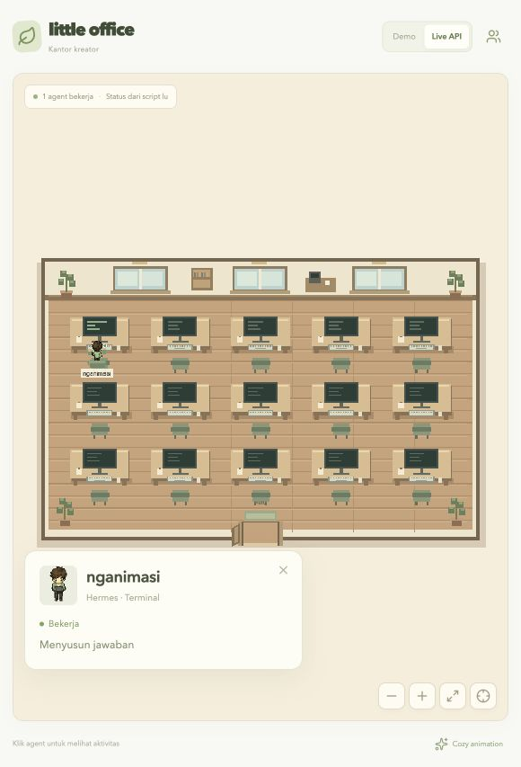

# Hermes → Little Office

Untuk memakai satu server pusat dan banyak mesin Hermes, ikuti [panduan server/client HTTP](SERVER-CLIENT.md). Catatan di bawah menjelaskan mode lokal yang sudah dipasang pada mesin ini; versi client terbaru mendukung keduanya.

Bridge ini menampilkan pekerjaan Hermes di kantor lokal: **satu session induk = satu orang**. Kebijakan nama diatur melalui `LITTLE_OFFICE_NAME_MODE`; default `alias` menampilkan pseudonim stabil seperti `Moss-42`, sedangkan `project` memakai nama folder, `random` membuat alias baru tiap session, dan `hidden` memakai nama generik. Dua session di folder yang sama tetap dua orang. Session yang dipakai lagi mempertahankan identitas orang yang sama.

## Cara pakai di mesin ini

Plugin `little-office-bridge` sudah dipasang dan diaktifkan di home Hermes default dan profil `airi`. Gateway default berhasil memuat ulang hook saat pemasangan; aktivitas Desktop sudah terlihat masuk ke viewer. Terminal yang terbuka sebelum pemasangan perlu dibuka ulang untuk memuat plugin. Profil `airi` belum mengonfirmasi gateway aktif saat pemasangan; jalankan session baru pada profil itu, atau restart gateway profil itu saat pekerjaan lu sudah selesai.

```sh
npm run dev -- --port 5174
```

Buka `http://127.0.0.1:5174/`, lalu gunakan Hermes seperti biasa. Update nyata pertama otomatis memilih **Live API**. Viewer juga bisa dibuka ketika Hermes sudah bekerja: snapshot bridge akan dibaca ulang. Nama tampil sebagai `Hermes` jika runtime belum menyediakan folder kerja; akan berubah begitu folder diketahui. Folder yang dipakai oleh subagent tidak mengganti nama session induk.

## Gerak mengikuti session

| Event Hermes | Kantor |
| --- | --- |
| Giliran kerja dimulai | Orang masuk melalui pintu dan menuju komputer |
| Menunggu model | Status berpikir |
| Menulis jawaban / menjalankan tool | Orang bekerja; nama tool dapat dilihat di kartu detail |
| Subagent bekerja | Tetap satu orang milik session induk |
| Giliran kerja selesai, gagal, atau dihentikan | Orang pulang melalui pintu |
| Proses Hermes mati / heartbeat terputus | Orang pulang dengan keterangan session tidak aktif |
| Giliran berikutnya di session yang sama | Orang yang sama masuk lagi |

Tidak ada hitungan selesai buatan untuk session nyata. Selama runtime menyatakan giliran masih berjalan, session tetap bekerja; operasi lama tidak dianggap selesai hanya karena tidak ada tool baru. Heartbeat setiap 10 detik; receiver mengecek sekitar setiap 750 ms, dan menganggap producer terputus setelah 35 detik atau langsung ketika PID sudah mati. Data orang yang pulang dibuang setelah 90 detik agar animasi keluar sempat selesai. Memilih Live API saat belum ada pekerjaan menampilkan kantor kosong.

## Mengapa memakai hook

[ACP Hermes](https://hermes-agent.nousresearch.com/docs/user-guide/features/acp) menyediakan koneksi untuk client ACP. Untuk memantau pemakaian terminal, Desktop, dan gateway Telegram, bridge ini memakai [lifecycle hook Hermes](https://hermes-agent.nousresearch.com/docs/user-guide/features/hooks) pada runtime yang sama. Plugin mengamati awal/akhir giliran, aktivitas tool, dan subagent. Plugin harus aktif pada **home/profile yang menjalankan session tersebut**; runtime lain, safe mode, atau versi Hermes tanpa hook tersebut tidak otomatis terbaca.

Plugin tidak menjalankan agent, mengubah tool, atau mengirim pesan Telegram. Event hanya berisi ID session yang dihash, nama publik sesuai kebijakan nama, jenis permukaan, status, nama tool, dan timestamp. Prompt, jawaban, command, argumen tool, full path, nama folder asli saat mode aman, serta kredensial tidak ditulis ke bridge.

## Pemasangan ulang / mesin lain

Hermes harus sudah terpasang dan menyediakan hook pada manifest plugin. Dari folder project:

```sh
hermes plugins validate integrations/hermes/little-office-bridge --json
python3 integrations/hermes/install_bridge.py
```

Untuk profile lain:

```sh
python3 integrations/hermes/install_bridge.py --home ~/.hermes/profiles/NAMA_PROFILE
```

Installer menyalin dua file plugin milik project dan memanggil `hermes plugins enable little-office-bridge --no-allow-tool-override`. File plugin sebelumnya disimpan sebagai `.previous` bila berbeda. Installer tidak mengedit core Hermes. Perintah resmi Hermes mengatur daftar plugin aktif dan mencoba aktivasi pada backend/gateway berjalan. Ikuti hasil aktivasi yang dicetak; jangan restart gateway di tengah pekerjaan.

Untuk server public, tambahkan ke `.env` client:

```dotenv
LITTLE_OFFICE_NAME_MODE=alias
LITTLE_OFFICE_MACHINE_LABEL_MODE=hidden
```

`alias` adalah default dan memakai salt lokal permission `0600`; nama folder asli tidak dikirim. Gunakan `project` hanya pada server private, `random` bila alias perlu berubah tiap session, atau `hidden` bila project sama sekali tidak boleh tampil. `LITTLE_OFFICE_MACHINE_LABEL_MODE=show` hanya aman untuk jaringan private.

Metadata ditulis atomik ke `~/.hermes/plugins/little-office-bridge/spool`, satu file per proses plugin. Semua profile memakai lokasi metadata yang sama. Viewer dev dan preview membaca lokasi ini, lalu menyiarkan snapshot melalui SSE yang sudah dipakai aplikasi. Setelah restart viewer, session masih aktif dipulihkan dari metadata; pekerjaan lama yang sudah selesai tidak dimainkan ulang. Manual API tetap tersedia dan berbagi batas kapasitas 64 orang.

Lokasi alternatif: set `LITTLE_OFFICE_HERMES_SPOOL` ke direktori yang sama pada proses Hermes dan server viewer sebelum dijalankan. Metadata tetap lokal pada mesin ini.

Diagnostik tanpa isi percakapan:

```sh
curl http://127.0.0.1:5174/api/integrations/hermes
```

Response berisi `enabled`, jumlah `producers` yang heartbeat-nya hidup, `activeSessions`, dan `lastPollAt`. `enabled` berarti receiver berjalan, bukan bahwa setiap runtime Hermes sudah memuat plugin.

Untuk mematikan bridge pada home/profile yang digunakan:

```sh
hermes plugins disable little-office-bridge
```

## Verifikasi

```sh
python3 -m unittest discover -s integrations/hermes -p 'test_*.py'
npm test
npm run build
```

Uji memeriksa identitas dan nama session, tiga permukaan, agregasi subagent, akhir/interupsi, metadata tanpa isi privat, replay receiver, deduplikasi heartbeat, producer mati/terputus, dan session yang bekerja kembali. Validator resmi Hermes memeriksa registrasi hook dalam isolasi. Verifikasi langsung di mesin ini menangkap session Desktop nyata beserta perubahan folder dan status selesai, serta session Terminal nyata bernama `nganimasi`. Telegram diuji pada kontrak hook; gateway default telah mengonfirmasi aktivasi hook. Tidak ada prompt model atau pesan Telegram percobaan yang dikirim. Total 16 tes Python/TypeScript dan build lulus.


