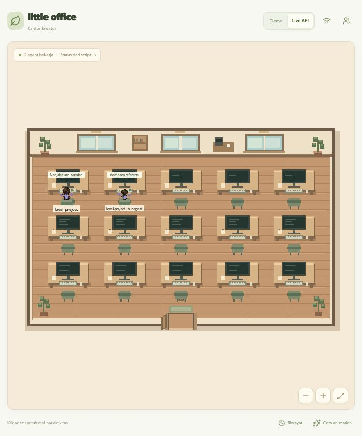

# Nekoffice v0.3 — subagent di samping agent utama

Status: implementasi lokal selesai dan sudah diuji dengan fixture API parent–subagent; belum dideploy ke domain publik.

v0.3 membuat hubungan parent–subagent terlihat di kantor lokal. Satu agent utama tetap menjadi orang utama berdasarkan thread/folder project. Subagent tampil sebagai avatar terpisah di meja sebelahnya, memakai ID dan lifecycle sendiri, tetapi tidak mengambil slot acak jauh dari parent.

## Tujuan

- Menampilkan subagent sebagai orang terpisah ketika Codex benar-benar membuka thread child.
- Menjaga `parentId` dari observer Codex sampai ke browser.
- Memilih kursi tetangga yang paling dekat dengan agent utama secara deterministik.
- Membuat subagent masuk, bekerja, menunggu, dan pulang sendiri tanpa membuat parent ikut pulang.
- Mempertahankan guardian approval sebagai metadata internal; guardian tidak menjadi avatar.
- Menguji perubahan melalui demo dan server lokal tanpa deploy ke domain publik.

## Kontrak data

```json
{
  "agent": {
    "id": "codex-child-session",
    "name": "yt-office-codex · subagent",
    "role": "Codex · Subagent",
    "parentId": "codex-parent-session",
    "status": "working",
    "task": "Membaca referensi"
  },
  "active": true
}
```

`parentId` memakai namespace ID yang sama dengan agent utama. Server memetakan ID mentah dari client ke ID server sebelum menyimpan snapshot. Payload tetap hanya metadata allowlist; prompt, reasoning, command, output tool, dan full path tidak ikut dikirim.

## Perilaku visual

1. Parent mendapat kursi seperti biasa.
2. Child mencari kursi kiri/kanan pada baris yang sama, lalu depan/belakang jika kursi samping penuh.
3. Posisi dipilih dari `parentId`, bukan dari urutan array snapshot, sehingga refresh tidak memindahkan kelompok.
4. Child memakai avatar lebih kecil dan label `Subagent` di daftar/detail, sementara bubble aktivitas tetap mengikuti status child.
5. Jika child selesai, hanya child yang berjalan ke pintu. Parent tetap duduk selama masih aktif atau masih mendampingi child aktif.
6. Jika parent selesai lebih dulu, parent tetap terlihat sebagai `Mendampingi subagent` sampai seluruh child selesai.
7. Guardian approval tetap disaring dan tidak menjadi orang.

## Pengujian lokal

- Demo menampilkan beberapa parent–child agar posisi tetangga dapat dilihat tanpa bridge eksternal.
- Unit test observer memastikan root dan child dikirim sebagai dua row dengan `parentId` yang benar.
- Unit test server memastikan parent ID remote dipetakan ke namespace provider dan child tidak ditimpa parent.
- Build dan test web tetap dijalankan.
- Preview terakhir memakai `npm run dev`/Live API lokal; perubahan belum dikirim ke VPS atau domain publik.



## Di luar v0.3

Orkestrasi subagent, membuka thread baru, dependency graph interaktif, dan kontrol pause/kill tetap dilakukan oleh Codex/Hermes. Nekoffice hanya memvisualisasikan event yang sudah diterima.
